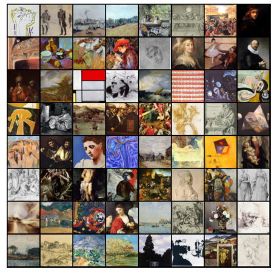
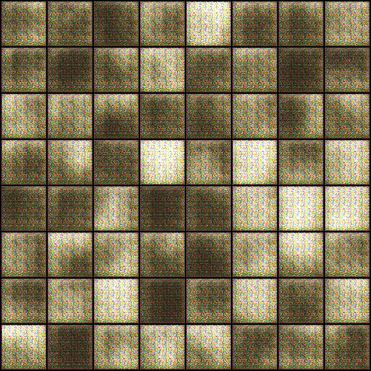
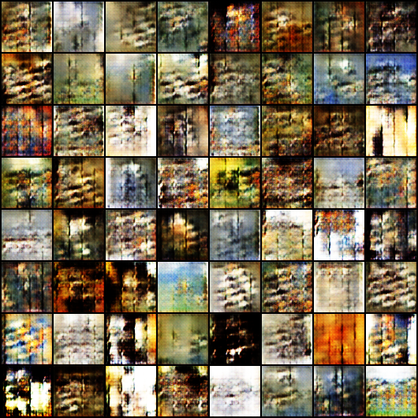
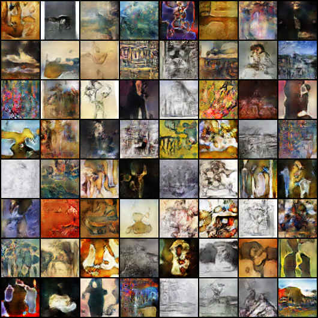
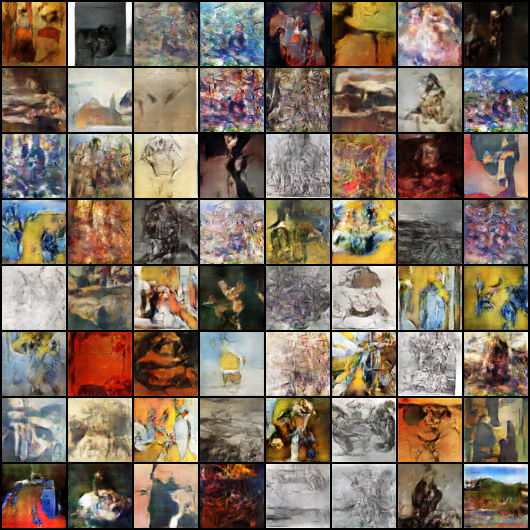

# NM-ARTGAN
This project on "ARTGAN" is a simple generative adversarial network-based on art images using deep learning &; PyTorch.
Generative Adversarial Networks, or GANs for short, are an approach to generative modeling using deep learning methods, such as convolutional neural networks.
In the gans_training file, we can view the improvement of the generative network.

Generative modeling is an unsupervised learning task in machine learning that involves automatically discovering and learning the regularities or patterns in input data in such a way that the model can be used to generate or output new examples that plausibly could have been drawn from the original dataset.

Dataset
----

Result:
----

**generated-images-01**

**generated-images-030**

**generated-images-0200**

**generated-images-0300**

